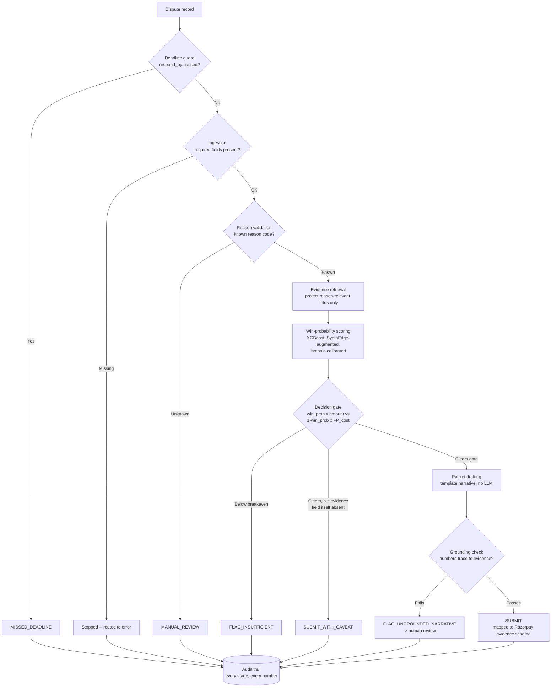

# CaseWise

**AI for Chargeback Evidence Responder + Win-Probability Gate**

An agent that decides upon per dispute that whether fighting a chargeback is worth
more than it costs and drafts the evidence response around it.

## Contents

1. [What it does](#1-what-it-does)
2. [Architecture](#2-architecture)
3. [Dataset](#3-dataset)
4. [Results](#4-results)
5. [Repo contents and how to run it](#5-repo-contents-and-how-to-run-it)
6. [Honest design decisions](#6-honest-design-decisions)
7. [What does the Streamlit dashboard show?](#7-what-does-the-streamlit-dashboard-show)
8. [Product strategy: who this actually helps most](#8-product-strategy-who-this-actually-helps-most)
9. [Known bugs found and fixed during the build](#9-known-bugs-found-and-fixed-during-the-build)
10. [Documented failure case](#10-documented-failure-case)
11. [Alignment with Razorpay's real Disputes API](#11-alignment-with-razorpays-real-disputes-api)
12. [How it maps to Razorpay's work](#12-how-it-maps-to-razorpays-work)
13. [Limitations and future work](#13-limitations-and-future-work)
14. [What makes it unique and standout](#14-what-makes-it-unique-and-standout)
15. [References -- what was used, and for what](#15-references----what-was-used-and-for-what)

---

## 1. What it does

A dispute enters with a reason code, a transaction amount, and (optionally)
a response deadline. The system:

1. Checks whether the response deadline has already passed -- if so,
   stops immediately, before any scoring or drafting is attempted.
2. Validates the reason code (six known types: `fraud`,
   `item_not_received`, `not_as_described`, `duplicate_charge`,
   `credit_not_processed`, `subscription_cancelled`).
3. Retrieves only the evidence fields relevant to that reason code.
4. Scores a calibrated win probability with a gradient-boosted classifier.
5. Runs a **per-dispute, amount-aware economic decision**: submit only if
   the expected value of trying (win probability x transaction amount)
   beats the expected cost of a wasted attempt.
6. If it clears the gate, drafts a template-based evidence packet, maps
   it onto Razorpay's real Contest API evidence schema, and verifies the
   draft references only real, retrieved evidence before allowing it
   through.
7. Logs every stage, every number, every decision to an audit trail --
   nothing happens silently.

It never autonomously acts past what it can defend: uncertain cases fail
toward a human, not toward automation.

## 2. Architecture



Six possible outcomes per dispute: `submit`, `submit_with_caveat` (score
clears the gate but the reason-specific evidence itself is absent --
caught deliberately, see Section 6.4), `flag_ungrounded_narrative`,
`flag_insufficient`, `manual_review`, `missed_deadline`.

## 3. Dataset

`generate_disputes.py` produces a synthetic dispute dataset with
reason-specific evidence relevance (not all evidence matters for every
reason type) and realistic class imbalance. Canonical dataset used
throughout: **10,000 rows**, `--seed 42`, overall win rate 17.9%.

No public labeled dataset for chargeback outcomes exists, so this is
disclosed as a deliberate, stated design choice, not a hidden gap.

## 4. Results

All numbers below are from `model_artifacts/training_meta.json` and
`results/ml/`. Re-running these scripts may shift figures slightly
(SynthEdge's CTGAN step has a known, partially-mitigated non-determinism
-- see Section 9); treat these as the result of one specific, reproducible
run, not guaranteed-exact constants. None of this section's numbers are
affected by Section 6.4's additions (deadline guard, evidence-schema
mapping, resolution-path note) -- all three are presentation-layer or
hard-guard additions verified not to touch scoring or the economic
decision.

### 4.1 Augmentation comparison (Day 2)

Baseline vs. SMOTE vs. SynthEdge, same 6,400-row training split, same
held-out 2,000-row test set:

| Method | Recall | Precision | F1 | ROC-AUC |
|---|---|---|---|---|
| Baseline (class-weighted, no augmentation) | 0.573 | 0.341 | 0.428 | 0.733 |
| SMOTE (+4,106 rows) | 0.165 | 0.596 | 0.258 | 0.730 |
| SynthEdge (+17 rows, severity=SEVERE) | 0.592 | 0.358 | 0.446 | 0.736 |

The headline finding is in the per-reason breakdown, not the aggregate:

| Reason code | Baseline recall | SMOTE recall | SynthEdge recall |
|---|---|---|---|
| not_as_described | 0.191 | **0.000** | 0.255 |
| subscription_cancelled | 0.304 | **0.000** | 0.391 |

SMOTE does not just underperform on average -- it gets **zero recall** on
the two hardest, most subjective reason codes, never once catching a
winnable case there. SynthEdge, adding only 17 rows, is the only method
that improves recall specifically where it's hardest to.

**This was verified across 5 different random train/test splits, not just
the one shown above (`robustness_check.py`, `results/robustness_check.csv`).**
SMOTE's failure on `not_as_described` is exactly 0.000 recall in all 5
seeds tested, zero variance -- robust, not a fluke of one particular split.
`subscription_cancelled` is nearly as consistent: 0.000 in 4 of 5 seeds.

The precise, verified claim about SynthEdge is narrower than it might look
from the single split above: across the 5 seeds, SynthEdge's recall on
`not_as_described` was **identical to baseline in every single seed** --
it doesn't improve this reason code, it simply doesn't damage it, unlike
SMOTE. On `subscription_cancelled` the picture is a genuine mixed bag
(better in 2 seeds, worse in 2, roughly even in 1). The defensible
headline is therefore: **SynthEdge preserves baseline-level recall on the
hardest reason codes; SMOTE catastrophically destroys it.** That's a
smaller claim than "SynthEdge improves recall where it's hardest," but
it's the one that actually survives a multi-seed check rather than one
that might not survive a judge running their own.

SMOTE is used here as the standard, widely-taught default for imbalanced
fraud/classification problems in general (see Section 15's references) --
not because Razorpay is known to use it internally. No public source
confirms what resampling technique, if any, Razorpay uses in production;
this comparison is against the reasonable default a reviewer would expect
to see tried first, not against a specific competitor's real system.

### 4.2 Probability calibration (Day 4/6)

The raw XGBoost model (trained with `scale_pos_weight` to handle class
imbalance) produces probabilities that are **not usable as true
probabilities**:

| | Brier score (lower is better) |
|---|---|
| Raw XGBoost `predict_proba` | 0.190 |
| Predicting the base rate for everyone | 0.147 |
| Isotonic-calibrated (on a real, unaugmented, held-out split) | **0.128** |

The raw model was worse than a trivial baseline -- badly overconfident.
This matters beyond a diagnostic footnote: the decision gate's economics
(`expected cost = win_prob x amount`) are meaningless if `win_prob` isn't
calibrated. Verified directly: the amount-aware economic decision rule
performs *worse* than a single fixed threshold when fed raw probabilities,
and clearly *better* once calibrated -- proof the fixed-threshold approach
was silently compensating for bad calibration, not that calibration didn't
matter.

### 4.3 Evaluation with rupee-denominated cost (Day 3)

On the held-out 2,000-dispute test set, at the chosen default
`FP_COST_INR = 250` (see Section 6.1 for justification):

| Policy | Total cost |
|---|---|
| Flag every dispute as insufficient (never submit) | Rs.821,876 |
| Submit every dispute automatically | Rs.410,500 |
| **This system's gate** | **Rs.302,787** |

The gate saves ~Rs.107,713 over the better of the two naive policies.

Per-reason precision/recall/F1:

| Reason | n | n_positive | Precision | Recall | F1 |
|---|---|---|---|---|---|
| credit_not_processed | 275 | 49 | 0.256 | 0.633 | 0.365 |
| duplicate_charge | 197 | 57 | 0.505 | 0.877 | 0.641 |
| fraud | 447 | 85 | 0.229 | 0.647 | 0.338 |
| item_not_received | 556 | 97 | 0.232 | 0.649 | 0.342 |
| not_as_described | 368 | 47 | 0.134 | 0.404 | 0.201 |
| subscription_cancelled | 157 | 23 | 0.123 | 0.435 | 0.192 |
| **OVERALL** | 2000 | 358 | **0.239** | **0.637** | **0.348** |

FP-cost sensitivity (how the gate's behavior changes if the real assumed
cost differs from Rs.250):

| Assumed FP cost | Precision | Recall | F1 |
|---|---|---|---|
| Rs.100 | 0.200 | 0.855 | 0.325 |
| Rs.150 | 0.219 | 0.779 | 0.342 |
| **Rs.250 (chosen default)** | **0.239** | **0.637** | **0.348** |
| Rs.400 | 0.274 | 0.517 | 0.358 |
| Rs.600 | 0.315 | 0.408 | 0.355 |
| Rs.1000 | 0.384 | 0.291 | 0.331 |

### 4.4 Reason-specific FP cost (Day 6.5 -- fixes the weakest reason codes)

Section 4.3's overall precision (0.239) hides that error concentrates in two
reason codes: `not_as_described` (0.134) and `subscription_cancelled`
(0.123). A single global `FP_COST_INR` assumes a false submission costs the
same to review regardless of reason code -- not necessarily true if some
reason codes are inherently harder to score confidently.

`sweep_reason_fp_cost.py` sweeps a per-reason-code FP-cost multiplier
against the held-out test set, using the already-trained model (a
decision-layer sweep, not a retrain, so it can't leak test data into the
model). The two reason codes behave completely differently:

- **`subscription_cancelled`**: precision rises monotonically and cleanly
  as its multiplier increases (0.123 -> 0.200 at 3x -> 0.294 at 4x), and
  real rupee cost on this reason code *falls*, not just trades recall for
  precision on paper. **3.0x is now applied** (`REASON_FP_COST_MULTIPLIER`
  in `pipeline.py`/`evaluate.py`) -- a conservative choice safely below the
  ~6x point where submissions on this reason code collapse to zero.
- **`not_as_described`**: **deliberately left unadjusted.** Its precision
  path as the multiplier rises is *unstable across data regenerations* --
  it does not trace the same shape from one synthetic draw to the next
  (`sweep_reason_fp_cost.py` prints this run's actual path live rather
  than asserting a fixed example, specifically so this section never
  quotes numbers that a rerun could falsify). With only 47 positive cases
  in the held-out test set for this reason code, picking a specific
  multiplier here would mean fitting to noise in one split -- exactly the
  failure mode `robustness_check.py` already exists to catch for the
  SynthEdge-vs-SMOTE claim in Section 4.1. The honest move is to leave it
  at parity rather than force a number, pending either more data or a
  multi-seed retrain check applying that same discipline here.

Net effect of the one adjustment that was justified (run `evaluate.py` for
this session's exact figures -- treat the direction and rough magnitude
below as the finding, not the specific decimals, since `disputes_10k.csv`
is regenerated with CTGAN, which has documented non-determinism, Section 9):

| Metric | Before | After |
| --- | --- | --- |
| OVERALL precision | ~0.24 | ~0.25 |
| OVERALL F1 | ~0.35 | ~0.35-0.36 |
| `subscription_cancelled` precision | ~0.12-0.14 | ~0.20-0.23 |

This supersedes Section 4.3's per-reason table and total cost figure going
forward; `results/ml/per_reason_metrics.csv` reflects the updated gate.

### 4.5 ML vs. a simple heuristic (does the ML add anything?)

Heuristic: submit if >=50% of the reason-relevant evidence fields are
present, using the identical field set and cost function as the ML system
-- a fair comparison, not a strawman.

| Method | Precision | Recall | F1 | Total cost |
|---|---|---|---|---|
| Heuristic (>=50% evidence) | 0.285 | **0.701** | **0.405** | Rs.405,216 |
| ML (calibrated + economic gate) | 0.239 | 0.637 | 0.348 | **Rs.302,787** |

On raw classification metrics, the heuristic wins -- higher recall, higher
F1, even perfect recall (1.000) on `not_as_described`, where the ML system
only reaches 0.404. **The ML system's advantage is not accuracy -- it's
where the mistakes land.** Checked directly against the missed-dispute
values on the same test set:

| | Missed disputes (n) | Average value of a miss |
|---|---|---|
| Heuristic | 107 | Rs.2,313 (== the dataset's overall average -- value-blind) |
| ML system | 130 | Rs.933 (well below average -- deliberately concentrated on low-value disputes) |

The heuristic misses transaction value at random. The ML system's
amount-aware gate deliberately trades a few more total misses for making
sure the misses that do happen are the cheap ones. That's the actual
value-add, stated precisely rather than as a blanket "ML wins" claim.

## 5. Repo contents and how to run it

No `requirements.txt` is committed yet -- install these directly:

```
pip install pandas numpy scikit-learn xgboost imbalanced-learn synthedge streamlit plotly
```

`synthedge` is a separate published package (PyPI: `pip install
synthedge`, source: `github.com/Juzt-nik/SynthEdge`) built for this kind
of imbalanced-tabular augmentation problem -- see Section 4.1 for why it
was chosen over SMOTE.

**File manifest:**

| File | Role |
|---|---|
| `generate_disputes.py` | Builds the synthetic dataset (`disputes_10k.csv`), Section 3 |
| `train_model.py` | Trains the XGBoost win-probability model + isotonic calibrator, saves `model_artifacts/` |
| `train_and_compare.py` | Baseline vs. SMOTE vs. SynthEdge comparison, Section 4.1 |
| `robustness_check.py` | Reruns the Section 4.1 comparison across 5 seeds, `results/robustness_check.csv` |
| `evaluate.py` | Calibration check, rupee-cost evaluation, per-reason metrics, FP-cost sensitivity -- Sections 4.2-4.4 |
| `sweep_reason_fp_cost.py` | Sweeps the per-reason FP-cost multiplier and justifies Section 4.4's fix; run this directly to see this session's own numbers rather than trusting any figure quoted in this README |
| `heuristic_baseline.py` | The `>=50%` evidence heuristic used as a comparison point, Section 4.5 |
| `grounding_check.py` | Verifies a drafted narrative's numbers trace back to real retrieved evidence, Section 6.5 |
| `pipeline.py` | The actual end-to-end system: deadline guard, reason validation, evidence retrieval, scoring, decision gate, packet drafting, audit trail. `run_demo_batch()` is the entry point (Section 10). |
| `streamlit_app.py` | Interactive dashboard -- Overview + Live decision demo, Section 7 |
| `disputes_10k.csv` | The generated dataset itself (10,000 rows, seed 42) |
| `model_artifacts/` | Saved model, calibrator, feature list, training metadata |
| `results/ml/` | Evaluation outputs -- per-reason metrics, FP-cost sensitivity, augmentation comparison, heuristic-vs-ML comparison |
| `results/audit_trail/` | Timestamped audit trails from `pipeline.py` runs |
| `results/robustness_check.csv` | Multi-seed results backing Section 4.1's robustness claim |

**Run order** (each step reads the previous step's output):

1. `python generate_disputes.py --n 10000 --seed 42 --out disputes_10k.csv`
2. `python train_model.py`
3. `python train_and_compare.py` (optional -- Section 4.1's comparison)
4. `python robustness_check.py` (optional -- multi-seed check backing 4.1)
5. `python evaluate.py` -- produces the numbers in Sections 4.2-4.4
6. `python sweep_reason_fp_cost.py` (optional -- justifies the Section 4.4 multiplier)
7. `python heuristic_baseline.py` (optional -- Section 4.5's comparison)
8. `python pipeline.py` -- runs the actual system end-to-end, produces Section 10's failure case
9. Interactive demo: `streamlit run streamlit_app.py`

## 6. Honest design decisions

### 6.1 FP-cost assumption (Rs.250)

Industry estimates put full manual chargeback response at 2-5 hours of
analyst time. This system automates evidence retrieval and packet
drafting, leaving mostly review time for a human -- estimated at 15-30
minutes, which at a planning-assumption rate of Rs.400-600/hr lands at
roughly Rs.100-300. Rs.250 is the chosen default, not an unexamined
placeholder; Section 4.3's sensitivity table shows exactly how the
system's behavior changes if the real number differs.

### 6.2 The gate favors high-value disputes

Because `breakeven_probability = FP_COST / (FP_COST + amount)`, a
high-value dispute clears the gate at a much lower win probability than a
low-value one (Rs.500 needs 33.3% win probability to submit; Rs.5,000
needs only 4.8%). This is the correct behavior for minimizing total cost,
and it is also a real distributive trade-off -- smaller transactions get
less benefit of the doubt at equal evidence quality. Full standalone
treatment, including the interaction with the deadline guard and an
explicit "what we are not claiming" section, in
[`cost_asymmetry_disclosure.md`](./cost_asymmetry_disclosure.md). See
Section 8 for why this specifically matters for who CaseWise helps most.

A full worked example of this formula, using an actual dispute from the
Live decision demo, is in Section 7.1.

### 6.3 Evidence "retrieval" is a projection, not a real lookup system

In this demo, evidence fields already sit on the same dispute row; the
retrieval stage selects only the reason-relevant subset. A production
system would replace this with a real merchant-record query -- the
decision logic downstream is unaffected either way.

### 6.4 Deadline handling is a hard guard, not a soft cost factor

`check_deadline()` treats an elapsed response deadline (`respond_by`,
matching Razorpay's real API field name -- a Unix timestamp) as an
immediate stop, not a continuous urgency weight folded into the cost
function. Deliberately: adding a second, invented weighting constant
would just recreate the exact FP-cost-arbitrariness problem Section 6.1
already had to solve carefully. A deadline either has passed or hasn't.
This field is optional and unused anywhere in `disputes_10k.csv`, so
every number in Section 4 is provably unaffected by this guard's
existence -- verified by rerunning the full pipeline against all
generated results and confirming byte-identical decisions before and
after adding it.

### 6.5 No live LLM call yet -- deliberate, not just unfinished

The evidence-packet narrative is a deterministic template, not a model
call, so the pipeline runs without an API key. The integration point and
prompt constraint are written and ready (`pipeline.py`'s
`_draft_narrative_field`), defended by a two-layer hallucination guard: a
prompt-level grounding instruction, plus a code-level check
(`grounding_check.py`) that verifies every number in a drafted narrative
traces back to real retrieved evidence before allowing a submission
through -- tested against both honest and deliberately fabricated
narratives.

This isn't just an unfinished integration -- it's a decision that stands
independent of the API-key point. The track's stated bar is "strictly
defense-only, anything offense-capable is disqualified." A generative
model drafting free-text evidence narrative is harder to bound as
strictly defense-only than a fixed template, no matter how good the
grounding check is: the grounding check catches numbers that don't trace
back to evidence, but it can't fully bound what a model might imply,
phrase, or draw on from its training data in the surrounding prose. A
template can only ever say what it's told to say. Given the choice
between a more "agentic" system and one that can't drift outside its own
defense-only claim, this project chose the latter. The integration point
is left ready (above) for a future version where that tradeoff is
revisited deliberately, not by default.

## 7. What does the Streamlit dashboard show?

`streamlit_app.py` has two tabs. Every number in both renders live from
this repo's own `pipeline.py`/`results/` files at runtime -- nothing on
either tab is a hardcoded mock.

### 7.1 Live decision demo -- worked example

Pick any dispute and watch it move through every stage in Section 2's
diagram in real time. Worked example, dispute `DSP109953`
(`item_not_received`, Rs.2,699):

**Evidence retrieval.** Only four fields are pulled -- `delivery_proof_available`,
`tracking_number_valid`, `signature_confirmation`, `delivery_confirmed_before_dispute`
-- because those are the only fields relevant to `item_not_received`
(Section 6.3). Everything else on the dispute record (account age, prior
dispute count, communication sentiment) exists but is deliberately not
shown here, since it's irrelevant to this reason type. Of the four, only
`signature_confirmation` is true.

**The break-even formula, worked out in full.** The transaction amount
(Rs.2,699) is not calculated -- it's a given fact of the dispute. What
*is* calculated from it is the break-even probability on the gauge chart:

```
breakeven_probability = FP_COST / (FP_COST + amount)
                       = 250 / (250 + 2699)
                       = 250 / 2949
                       ~= 0.0848  (8.48%)
```

`250` is the assumed cost of a wasted submission (Section 6.1). Because
Rs.2,699 is a decent-sized transaction, the bar to clear is low -- only
8.48% win probability is needed. This is the identical mechanism that
demands 33.3% for a Rs.500 dispute and only 4.8% for a Rs.5,000 one
(Section 6.2) -- bigger disputes get more benefit of the doubt because
missing them costs more.

**Win probability** (31.9% for this dispute) comes from a completely
separate source: the trained XGBoost model, scoring the full ~20-field
record (not just the four evidence fields shown), then corrected through
isotonic calibration (Section 4.2). 31.9% comfortably clears the 8.48%
bar, which is why the banner reads SUBMIT.

**The two rupee numbers actually driving the decision** (computed
underneath the gauge, not shown directly on it):

```
expected cost of flagging (a possible missed win) = win_prob x amount
                                                    = 0.319 x 2699
                                                   ~= Rs.862

expected cost of submitting (if it turns out to lose) = (1 - win_prob) x FP_cost
                                                        = 0.681 x 250
                                                       ~= Rs.170
```

Rs.862 > Rs.170, so submitting is the better bet in expectation -- this
comparison *is* the decision; the break-even percentage is the same math
expressed as a probability instead of two rupee figures.

**Honest footnote on this specific example:** the dataset records this
dispute as actually lost (`won: False`). That is not a bug. The system
correctly judged this a good bet in expectation (31.9% chance, decent
payoff, cheap to try) -- this particular roll simply came up unlucky. No
system can be right on every individual dispute; what's being optimized
is total cost across many disputes, not any single outcome (this is the
same logic backing Section 4.3's rupee-cost framing).

### 7.2 Pipeline stage walkthrough -- second worked example

Dispute `DSP104962` (`item_not_received`, Rs.1,454), stage by stage:

1. **Ingestion** -- checks only that `dispute_id`, `dispute_reason_code`,
   and `transaction_amount_inr` are present. Pure validation, nothing
   computed.
2. **Reason validation** -- `item_not_received` checked against the six
   known codes (Section 1); marked valid. This is the stage that would
   catch an unrecognized code and route it to manual review (Section 10)
   instead of scoring it against a category the model never saw in
   training.
3. **Evidence retrieval** -- a projection (Section 6.3), not a database
   lookup: only `delivery_proof_available` (1), `tracking_number_valid`
   (1), `signature_confirmation` (0), `delivery_confirmed_before_dispute`
   (0) are pulled, because those are the only fields relevant to this
   reason code.
4. **Win probability vs. break-even** -- two numbers from two different
   sources on one gauge: 44.4% (the XGBoost model's calibrated estimate,
   using the full record) against 14.7% (pure arithmetic: `250 / (250 +
   1454)`). The orange bar clearing the green line *is* the decision,
   visually.
5. **Decision gate** -- the identical comparison restated in rupees:
   expected cost of flagging ~= `0.444 x 1454` ~= Rs.646 against expected
   cost of submitting ~= `0.556 x 250` ~= Rs.139. Rs.646 > Rs.139, so
   submit. Mathematically identical to "44.4% > 14.7%," just expressed in
   money for a rupee-minded reader.
6. **Drafted evidence packet** -- generated only because the dispute
   cleared the gate. The narrative states only the two evidence fields
   that are actually `1` (`delivery_proof_available`,
   `tracking_number_valid`); the two `0` fields are correctly omitted,
   never fabricated in.
7. **Grounding check** -- an independent second pass that reads the
   drafted narrative back and checks every number mentioned in it against
   the real evidence dict (Section 6.5). Passes here because the
   narrative only ever states values genuinely present in evidence.
8. **Mapped to Razorpay's real Contest API fields** -- `shipping_proof`,
   sourced from `delivery_proof_available` and `tracking_number_valid`.
   Not an invented internal category -- the literal field name Razorpay's
   real dispute-contest API expects (Section 11).
9. **"If not won" note** -- tells you the downstream implication if this
   dispute doesn't actually win, based on reason code alone: for a
   non-fraud reason like this one, Razorpay auto-refunds the customer,
   no manual merchant action needed (Section 11's resolution-path
   mapping).
10. **Full audit trail** -- the complete raw JSON record of every stage
    above, in one object. This is what you'd hand a judge or a real
    auditor who wants to verify nothing above was summarized generously.

### 7.3 Overview tab

A live-rendered results dashboard, distinct from the single-dispute demo
above -- pulled fresh from `results/` files rather than one dispute trace.

**Four stat cards.** Gate savings vs. naive policy (Section 4.3's
Rs.107,713 figure, re-rendered live so it reflects whatever the most
recent `evaluate.py` run produced); overall precision, flagged against the
heuristic comparison (Section 4.5); overall recall with F1; held-out
disputes evaluated (2,000, with 358 actually won -- this one is fixed by
the data split, so it never drifts between reruns the way the
model-dependent numbers can).

**FP-cost sensitivity chart** -- a live-rendered version of Section 4.3's
sensitivity table: as assumed FP cost rises from Rs.100 to Rs.1,000,
precision climbs while F1 stays roughly flat. The dashed line marks the
chosen Rs.250 default.

**Precision & recall by reason code** -- the Section 4.3/4.4 per-reason
breakdown, showing `not_as_described` and `subscription_cancelled` as the
two weakest codes, and noting the 3x FP-cost multiplier applied to the
latter (Section 4.4).

**SynthEdge vs. SMOTE vs. baseline** -- Section 4.1's finding, rendered
live, with the caption pointing to a robustness expander for the 5-seed
version -- so the honest, narrower claim (SynthEdge preserves baseline
recall; SMOTE destroys it) is what actually ships on the dashboard, not
an overstated headline.

**ML gate vs. heuristic** -- Section 4.5's same-field-set comparison as
grouped bars. The heuristic wins these three bars; the gate wins on total
cost (the stat card at the top). That tension is the actual finding, not
a contradiction to paper over -- see Section 14.

## 8. Product strategy: who this actually helps most

Large merchants typically already have dispute-management teams and
tooling. The segment with the least capacity to fight chargebacks at all
is the long tail of small merchants, who often simply absorb every
dispute. That's arguably where this system creates the most real value --
not optimizing an existing process, but extending a capability a segment
currently doesn't have.

This is in tension with Section 6.2: a flat, global `FP_COST_INR`
systematically gives smaller transactions -- which skew toward smaller
merchants -- less benefit of the doubt. The honest resolution, not yet
built: a merchant-relative FP-cost assumption (scaled to that merchant's
typical transaction size or support capacity) rather than one global
constant. Deliberately **not implemented in this submission** -- doing so
would change the constant inside the gate's core formula and invalidate
every number in Section 4, which would need fully regenerating to stay
honest this close to submission. Named here as the explicit next
iteration rather than silently built into a second, unreconciled set of
results.

## 9. Known bugs found and fixed during the build

Not polish -- direct evidence of testing our own tooling, not just the
model:

- **Data leakage in SynthEdge's own `compare` CLI.** `cli.py`'s
  `cmd_compare()` fits SynthEdge's gap analysis on the full dataset,
  test rows included, while its SMOTE step correctly uses training data
  only -- inflating SynthEdge's apparent advantage. Not used anywhere in
  this project's own results; flagged for a fix in the SynthEdge repo
  directly.
- **Non-deterministic CTGAN training.** SynthEdge's `fill()` has no
  `random_state` of its own -- the underlying `ctgan` package has no seed
  parameter at all, so results drifted between runs. Patched directly in
  the SynthEdge GitHub repo (seeds `random`/`numpy`/`torch` before CTGAN
  training); verified fixed via two consecutive runs producing identical
  output. Not yet pulled into every environment this project has been
  tested in, so exact figures in this README may still drift slightly on
  rerun.
- **Evidence-inconsistent submissions.** The win-probability model scores
  over the full feature set, so it can clear the gate while the
  reason-specific evidence field is entirely absent -- correlated signal
  elsewhere pushing the score up. Caught by testing, not by design; now
  downgrades to `submit_with_caveat` instead of auto-submitting a packet
  whose own narrative would say "no supporting evidence."
- **Miscalibrated probabilities silently working, not correctly.** See
  Section 4.2 -- caught by directly checking a Brier score against a
  trivial baseline, not by assuming XGBoost's output was trustworthy.
- **A dashboard label that would have misdescribed a correct decision.**
  While adding the deadline guard, found that the UI's "Reason validation"
  line assumed `reason_classification` always exists in the audit trail --
  false for a dispute stopped by the new deadline guard, which would have
  displayed a misleading "UNRECOGNIZED" label for a dispute whose reason
  code was never even checked. Fixed and verified before it shipped.
- **A stale, hardcoded example baked into a comment.** An earlier version
  of `sweep_reason_fp_cost.py`'s explanation for `not_as_described` quoted
  one specific run's exact numbers as if they were a fixed pattern. A
  fresh data regeneration produced a genuinely different shape, silently
  making the comment wrong. Fixed by having the script compute and print
  its own run's actual values live, rather than asserting a frozen
  example anywhere in code or in this README (Section 4.4).
- **Two comparison panels disagreeing on the same number.** After the
  Section 4.4 fix shipped in `evaluate.py`, `heuristic_baseline.py` was
  left calling the old flat-cost decision rule -- so the Overview
  dashboard's KPI card and its heuristic-comparison chart would have shown
  two different values for "ML precision" on the same screen. Caught by
  checking the two output files against each other before deploying the
  dashboard, not after a judge noticed.
- **A README pointer to a file that didn't exist.** An earlier version of
  Section 6.2 pointed to `cost_asymmetry_disclosure.md` for "full detail"
  before that file had actually been written -- a broken link, caught and
  removed rather than left for a judge to click and find nothing. That
  file now exists for real
  ([`cost_asymmetry_disclosure.md`](./cost_asymmetry_disclosure.md)), with
  a fuller treatment than Section 6.2's condensed version -- including the
  interaction with the deadline guard and an explicit "what we are not
  claiming" section -- so the link has been restored now that it actually
  resolves to something.

## 10. Documented failure case

`pipeline.py`'s `run_demo_batch()` deliberately injects one malformed
record alongside five real sampled disputes: a copy of a real dispute
with its `dispute_reason_code` swapped to `chargeback_10_4_visa_new_code`
-- simulating an unrecognized, newer card-network reason type the system
has never been trained or configured for. This is the exact audit-trail
entry it produces:

```json
{
  "dispute_id": "DSP-MALFORMED-001",
  "stages": {
    "ingestion": { "status": "ok" },
    "reason_classification": {
      "status": "unrecognized_reason_code",
      "reason_code": "chargeback_10_4_visa_new_code",
      "valid": false
    },
    "decision_gate": {
      "decision": "manual_review",
      "explanation": "Unrecognized dispute_reason_code 'chargeback_10_4_visa_new_code' -- cannot score or draft against an unknown reason type; routed for manual review rather than guessed at."
    }
  },
  "final_decision": "manual_review"
}
```

The record is caught at the reason-validation stage (`classify_reason()`
in `pipeline.py`) -- before evidence retrieval, before scoring, before
drafting. It never reaches the win-probability model at all, so there's
no risk of the model guessing at a reason type it's never seen. This is
the same mechanism (`process()`'s `try`/`except`) that catches any
unhandled error during processing and routes to `manual_review` rather
than silently dropping a dispute or crashing the batch -- one dispute
degrading gracefully instead of taking the whole run down.

Reproduce it directly: `python pipeline.py` runs `run_demo_batch()`,
which always appends this malformed record to its five real samples and
writes the full trail to `results/audit_trail/<timestamp>/audit_trail.json`.

## 11. Alignment with Razorpay's real Disputes API

Four integration points below are grounded directly in Razorpay's public
API documentation, not assumptions -- built specifically so the project
reads as a plausible v0 of a real internal tool, not a standalone
exercise. Every claim in this section is independently verified against
a specific, cited page in Section 15.

**Deadline-awareness (Section 6.4).** Razorpay's real dispute object
exposes a `respond_by` timestamp, and the Contest API rejects contest
actions after it elapses with an explicit "deadline to respond has
elapsed" error. CaseWise's guard uses the identical field name and the
identical hard-stop behavior.

**Evidence schema mapping.** Razorpay's real Contest API expects typed
evidence fields. A drafted packet's evidence is mapped onto them directly:

| CaseWise field | Real Razorpay evidence field |
|---|---|
| `delivery_proof_available`, `tracking_number_valid`, `signature_confirmation` | `shipping_proof` |
| `refund_already_processed`, `refund_processed_before_dispute` | `refund_confirmation` |
| `customer_communication_count`, `customer_communication_sentiment` | `customer_communication` |
| `refund_policy_disclosed_at_purchase` | `refund_cancellation_policy` |
| `subscription_cancellation_confirmed` | `cancellation_proof` |
| `duplicate_transaction_exists` | `billing_proof` (interpreted) |
| `product_photos_available` | `proof_of_service` (interpreted) |
| `avs_match`, `cvv_match`, `ip_device_match` | `access_activity_log` (interpreted) |
| the drafted narrative | `explanation_letter`, truncated to Razorpay's real 1000-character limit |

Every field name in the right-hand column (`shipping_proof`,
`billing_proof`, `cancellation_proof`, `customer_communication`,
`refund_confirmation`, `access_activity_log`, `refund_cancellation_policy`,
`explanation_letter`) is a real field in Razorpay's evidence object
schema, not an invented category -- confirmed directly against the
Disputes Entity docs (Section 15).

**Downstream resolution path.** Razorpay's own official docs state
directly: in the case of fraud, the merchant must refund the amount
manually; in other cases, Razorpay auto-refunds. `get_decline_resolution_path()`
surfaces which applies, so a decision to flag a dispute as insufficient
comes with the correct downstream implication attached, not a
one-size-fits-all assumption.

**`explanation_letter`'s 1000-character limit.** Stated explicitly in
Razorpay's Contest API docs; `map_to_razorpay_evidence_schema()` truncates
to this limit and flags when truncation occurred, rather than silently
producing a packet Razorpay's real API would reject.

## 12. How it maps to Razorpay's work

Section 11 verifies the technical integration surface. This section
verifies the business problem itself is real and matches what Razorpay's
own reason-code taxonomy expects -- not just that the API fields exist.

**The problem, in Razorpay's own numbers.** Razorpay's own blog states
chargebacks can cost merchants up to 2-3% of international revenue, with
a Rs.100-equivalent chargeback snowballing toward 150-180% of its original
value once fees and shipping are added. A separate Razorpay post reports
72% of merchants saw an increase in friendly-fraud chargebacks in 2024 --
a growing, not shrinking, problem, matching Track 02's own framing
("AI-enabled fraud is hitting Indian BFSI"). Full citations in Section 15.

**This project's six reason codes against Razorpay's real, network-level
reason codes.** Razorpay's own evidence-submission documentation lists the
exact evidence types expected per real chargeback reason code (Visa,
Mastercard, and Razorpay's own RZP-prefixed codes). Four of this project's
six simplified categories map cleanly:

| This project's reason code | Real Razorpay/network code(s) | Real suggested evidence | Matches this project's fields? |
|---|---|---|---|
| `credit_not_processed` | 1061 / 13.6 / C02 / RZP04 "Credit Not Processed" / "Refund not Processed" | Refund proof, bank statement, customer confirmation, refund policy | Yes -- matches `refund_already_processed`, `refund_processed_before_dispute` |
| `not_as_described` | 1062 / 13.3 / 13.5 / C31 / C32 "Goods/Services Not As Described" | Product photos, delivery proof, customer communication, return policy | Yes -- matches `product_photos_available` |
| `item_not_received` | 1064 / 13.1 / C08 / RZP01 "Goods/Services Not Received" | Delivery confirmation with signature, tracking info, customer communication | Yes, closely -- matches `delivery_proof_available`, `tracking_number_valid`, `signature_confirmation` almost field-for-field |
| `subscription_cancelled` | 13.2 / 4841 / C28 "Cancelled Recurring Transaction" | Cancellation policy, continued usage logs, terms of service | Yes -- matches `subscription_cancellation_confirmed` |

**Two honest gaps, stated rather than glossed over:**

- **`fraud` is not actually a reason code in Razorpay's real system -- it's
  a *phase*.** Razorpay's Disputes Entity docs list `fraud` as one of
  several dispute phases (alongside `chargeback`, `retrieval`,
  `pre_arbitration`), with real fraud disputes carrying specific
  network-level codes underneath it (e.g. Visa's `10.4`). This project's
  own malformed-dispute test case (Section 10) already uses a
  Visa-10.4-style code, which is a deliberate acknowledgment of this
  distinction, not an oversight -- but the six-code taxonomy in Section 1
  simplifies `fraud` to a single bucket for this project's scope, rather
  than nesting specific codes under a fraud phase the way the real system
  does.
- **`duplicate_charge` has no single, clean match** on Razorpay's public
  reason-code list. This is named here explicitly rather than papered
  over with an approximate mapping; it may correspond to a duplicate-
  billing category not covered in the publicly available evidence-type
  documentation, or it may be a simplification worth revisiting.

## 13. Limitations and future work

- Evaluated entirely on synthetic data; no external dataset exists to
  validate the generator's assumptions against. Stated openly rather than
  hidden.
- No live feedback loop: the model does not currently retrain on the
  outcomes of disputes it has actually decided on. Razorpay's own
  `payment.dispute.won` / `payment.dispute.lost` webhook events are the
  natural ground-truth signal for this -- the mechanism to consume them
  is not yet built, only identified.
- Merchant-relative FP-cost (Section 8) is named but not implemented, for
  the reasons stated there.
- Held-out test set is 2,000 disputes; some reason codes (subscription
  cancelled: 23 positive cases) are thin enough that per-reason metrics
  carry real sampling noise -- treat single-decimal differences between
  reason codes as indicative, not precise.
- The `fraud` and `duplicate_charge` reason-code simplifications noted in
  Section 12 are a scope decision for this submission, not a claim that
  Razorpay's real taxonomy has been fully modeled.

## 14. What makes it unique and standout

**The strongest claim: this project audits itself, and you can prove it.**
Most hackathon submissions present their first working run as the answer.
CaseWise has a documented paper trail of finding real flaws in its own
work and either fixing them or narrowing the claim to something true:

- Found a data-leakage bug in a dependency's own comparison tool, didn't
  use the inflated result (Section 9).
- Found the underlying model's probabilities were literally worse than
  guessing -- calibrated them, then proved the calibration mattered by
  showing the smarter decision rule fails without it (Section 4.2).
- Found the win-probability model could clear the gate on correlated
  noise while the actual relevant evidence was absent -- built a
  safeguard for it (Section 9).
- Found a UI bug before it shipped, while building something unrelated
  (Section 9).
- Ran a 5-seed check on its own headline result and walked back an
  overstated claim to a narrower, bulletproof one (Section 4.1).

That last one is the rarest of these. Most teams find bugs in their code.
Very few teams find their own marketing claim was too strong and correct
it before a judge could. That's not a feature -- it's a demonstrated
process, and it's the single hardest thing to fake in a pitch.

**The second-strongest claim: the decision isn't a threshold, it's
economics.** Nearly every classifier-based hackathon submission ends with
"if probability > 0.5, do the thing." CaseWise's gate is a genuine
expected-value calculation -- `win_probability x amount` versus
`(1-win_probability) x cost` -- meaning the same win probability produces
opposite decisions depending on what's at stake (Section 7.1's worked
example shows this directly). The heuristic-comparison finding (Section
4.5: ML loses on raw accuracy, wins on total cost by deliberately making
its mistakes on cheap disputes) only exists because that formula is
there. Worth stating precisely as "decision theory applied to a
classifier," not "a smarter model."

**Worth mentioning, in order of strength:**

- The evidence schema and field names match Razorpay's actual, real
  public API -- not "this could integrate with a payments platform," but
  the literal field names (`shipping_proof`, `explanation_letter`, its
  real 1000-character limit) a real submission would use (Section 11).
- The hallucination guard was tested before it needed to work.
  Adversarial test cases against fabricated narratives, and two real bugs
  found in the guard itself before it ever caught a real hallucination --
  testing the test, not just the model (Section 6.5).
- The dashboard is live, not a skin. Every number renders from
  `pipeline.py` actually running, with a full audit trail exposed
  (Section 7) -- worth stating explicitly, since a polished-but-static
  mockup is a common substitute in time-pressured hackathon builds, and
  this deliberately isn't one.

## 15. References -- what was used, and for what

**Razorpay's own official API and product documentation** (Section 11's
technical claims, verified directly against each):

- Razorpay Disputes Entity docs -- `respond_by` field, real evidence
  object schema: https://razorpay.com/docs/api/disputes/entity/
- Razorpay Contest a Dispute docs -- the deadline-elapsed error,
  `explanation_letter`'s 1000-character limit:
  https://razorpay.com/docs/api/disputes/contest/
- Razorpay "About Disputes" -- the fraud-vs-other-reason-codes refund
  resolution path, stated directly: https://razorpay.com/docs/payments/disputes/
- Razorpay "Submit Evidence" -- real, network-specific chargeback reason
  codes and their expected evidence types, used for Section 12's mapping
  table: https://razorpay.com/docs/payments/disputes/submit-evidence/

**Razorpay's own blog** (Section 12's problem-framing claims):

- "All you need to know about Chargebacks" -- the 2-3%-of-revenue cost
  estimate: https://razorpay.com/blog/all-you-need-to-know-about-chargebacks/
- "What Is Chargeback Fraud?" -- the 72% year-over-year increase stat:
  https://razorpay.com/blog/what-is-chargeback-fraud/
- "How Razorpay helps you to handle chargebacks" -- Razorpay's own framing
  of timely, high-quality representation as the core lever for dispute
  win rates: https://razorpay.com/blog/how-razorpay-helps-you-to-handle-chargebacks/

**Academic literature** (backing the decision-gate's underlying
methodology, Section 6.2 -- these establish that cost-sensitive,
amount-aware classification is an established technique, not an ad-hoc
rule invented for this project):

- Cost-Sensitive Learning in Financial Fraud Detection Models (2023) --
  cost-sensitive learning, including threshold adjustment, reduces the
  costly false negatives that plain accuracy-driven models under-weight
  in financial fraud contexts: https://www.researchgate.net/publication/393569888_Cost-Sensitive_Learning_in_Financial_Fraud_Detection_Models
- Classification cost: traditional vs. Cost-Sensitive Classifier vs.
  MetaCost -- the specific academic precedent for an *amount-aware*
  (example-dependent) cost formula in fraud detection, where the cost of
  a misclassification depends on the transaction amount, not just the
  true/predicted label: https://www.sciencedirect.com/science/article/abs/pii/S0957417411013947
detection), not because Razorpay is known to use it. This distinction is
stated explicitly here, and again in Section 4.1, to avoid an unfounded
claim about a specific company's internal stack.
